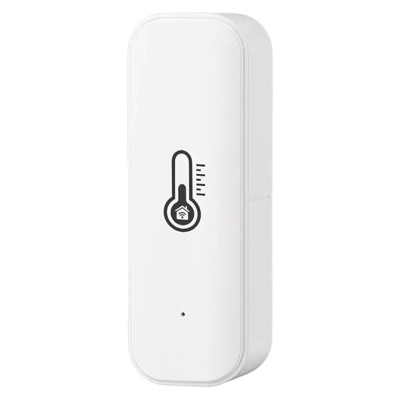

# Tuya IoT Back Cover Mod with Magnet Mounting

This repository contains the STL file for a custom back cover specifically designed for the Tuya IoT temperature and humidity sensor. The design introduces slots for small magnets. The slots are designed to fit magnets with a diameter of **10mm** and a height of **1.6mm**.

  

## 📂 Content

- [`tuya_back_cover_with_magnet_holes.stl`](models/printable/tuya_back_cover_with_magnet_holes.stl): STL file for the modified back cover. [Here](assets/tuya_back_cover_with_magnet_holes.jpg) you can find a 3D rendering preview of the model.

## ✨ Features

- **Magnet Slots**: Precise cutouts fit 10mm x 1.6mm magnets for easy attachment to metallic surfaces.
- **Perfect Fit**: Custom-designed for the Tuya IoT temperature and humidity sensor.
- **3D Print Ready**: Optimized for seamless and reliable 3D printing.

## 🛠️ Requirements

### Tools and Materials

1. **Magnets**:
   - Diameter: 10mm
   - Height: 1.6mm
2. **3D Printer**:
   - Compatible with PLA, ABS, or PETG filaments.
3. **Slicing Software**:
   - e.g., Cura, PrusaSlicer, Simplify3D
4. **Glue or Adhesive**:
   - For securing magnets.

## 🖨️ Printing Instructions

1. **Download the STL File**: 
   - Clone the repository or download the `tuya_back_cover_with_magnet_holes.stl` file directly.

2. **Prepare for Printing**: 
   - Import the STL file into your preferred slicing software.
   - Recommended settings:
     - **Layer Height**: 0.15mm
     - **Infill**: 20% (adjust based on desired strength)
     - **Supports**: None (designed to print without supports).

3. **Print the Model**: 
   - Load the sliced file into your 3D printer.
   - Use a material suitable for your use case (e.g., PLA for indoor use, PETG for outdoor or humid environments).

4. **Post-Processing**:
   - Insert the magnets into the slots.
   - Use glue or adhesive to secure the magnets.

## 📋 Usage

1. Ensure the magnets are securely placed in the slots.
2. Replace the original back cover with the 3d printed one.
3. Place the device on a magnetic surface.

## 📜 License

This project is licensed under the CC BY 4.0 License. See the [LICENSE](LICENSE) file for details.
